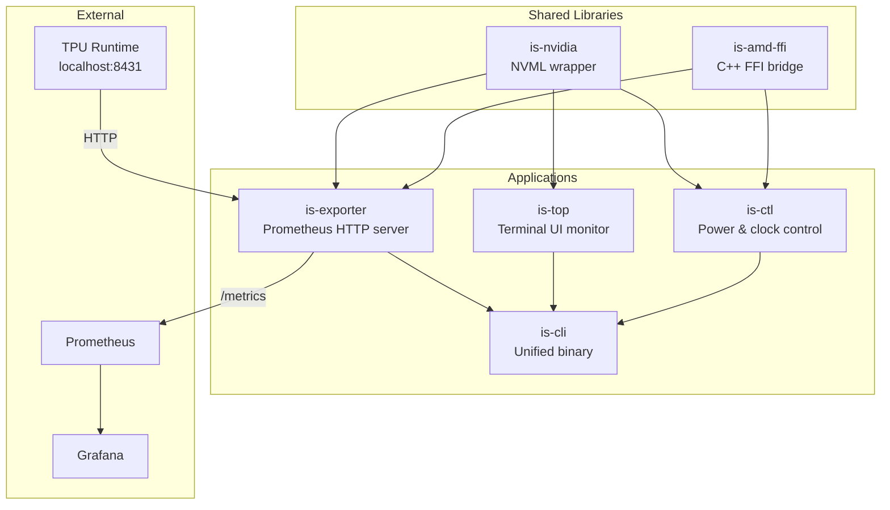

<p align="center">
  <h1 align="center">InferSight</h1>
  <p align="center">
    <strong>Production-grade GPU observability & control toolkit for heterogeneous compute infrastructure</strong>
  </p>
  <p align="center">
    <a href="https://github.com/infervisor/infersight"></a>
    <a href="https://github.com/infervisor/infersight"></a>
    <a href="https://github.com/infervisor/infersight"></a>
    <a href="https://github.com/infervisor/infersight"></a>
  </p>
  <p align="center">
    <a href="#overview">Overview</a> •
    <a href="#features">Features</a> •
    <a href="#installation">Installation</a> •
    <a href="#architecture">Architecture</a> •
    <a href="#usage">Usage</a> •
    <a href="#development">Development</a> •
    <a href="https://infervisor.ai/blog/infersight">Blog</a>
  </p>
</p>

---

## Overview

InferSight provides unified monitoring, metrics export, and power management for NVIDIA, AMD, and Google Cloud TPU accelerators from a single Rust workspace.

The project exists because GPU observability tooling is fragmented across vendors: `nvidia-smi` is vendor-locked and difficult to parse programmatically, AMD and TPU tooling is separate, and none integrates natively with Prometheus/Grafana monitoring stacks. InferSight solves this by providing a single codebase that auto-detects available hardware, exposes labeled Prometheus metrics, offers an interactive terminal dashboard, and enables validated power and clock management.

Design goals:

- Vendor-agnostic interface through a shared `Collector` trait
- Feature-flag compilation so only relevant hardware support is included
- Zero-config auto-detection with graceful degradation when hardware is absent
- Single static binaries with no runtime dependencies beyond GPU drivers
- First-class integration with Prometheus, Grafana, and Kubernetes

Intended users are SREs, ML engineers, and platform teams operating GPU clusters who need production-grade telemetry and control.

---

## Features

- Multi-vendor GPU support: NVIDIA (NVML), AMD (ROCm SMI via C++ FFI), Google Cloud TPU (local metrics endpoint)
- Prometheus-native `/metrics` endpoint with per-device labeled time series
- Interactive terminal monitor with per-core CPU bars, GPU utilization gauges, VRAM usage, sparkline history, and process listing
- GPU clock speed and power limit management with hardware constraint validation
- Unified binary combining export, monitor, and control subcommands
- Feature-flag compilation: build only what your hardware requires
- Graceful degradation: unavailable vendors are skipped without crashing
- Structured logging via `tracing` with runtime-configurable levels
- Pre-built Grafana dashboard for immediate visualization

---

## Architecture



The workspace is organized into six crates:

`is-nvidia` provides a safe Rust wrapper around the NVML library, exposing device enumeration, metrics collection, clock management, and power limit control. All other crates that interact with NVIDIA hardware depend on this shared library.

`is-amd-ffi` provides a CXX bridge to AMD's SMI C++ library. On non-AMD or non-x86_64 platforms, it compiles stub implementations that return error codes.

`is-exporter` implements the `Collector` trait with vendor-specific implementations (NVIDIA, AMD, TPU, System). A `CollectorManager` orchestrates initialization and periodic collection. Metrics are registered in a global Prometheus `Registry` and served via an Axum HTTP server.

`is-top` reuses the exporter's collectors to populate an interactive Ratatui-based terminal UI. It displays per-core CPU usage, memory/swap/disk, all GPU metrics, history sparklines, and GPU process lists.

`is-ctl` provides validated GPU control operations (clock speeds, power limits, performance levels, reset) for both NVIDIA and AMD, with JSON and text output formats.

`is-cli` composes all other crates into a single `infersight` binary with `export`, `top`, and `ctl` subcommands.

---

## Installation

```bash
git clone https://github.com/infervisor/infersight.git
cd infersight
cargo build --release
```

Binaries are placed in `target/release/`:

```bash
ls target/release/is-exporter target/release/is-top target/release/is-ctl target/release/infersight
```

To install system-wide:

```bash
sudo cp target/release/is-exporter /usr/local/bin/
sudo cp target/release/is-top /usr/local/bin/
sudo cp target/release/is-ctl /usr/local/bin/
sudo cp target/release/infersight /usr/local/bin/
```

### Nix

A `flake.nix` is provided for reproducible builds:

```bash
nix build          # Build the unified infersight binary
nix develop        # Enter development shell with Rust toolchain
```

---

## Requirements

| Requirement | Details |
|-------------|---------|
| Language | Rust (edition 2021) |
| Platform | Linux (x86_64 for AMD support) |
| NVIDIA support | NVIDIA GPU drivers with NVML library installed |
| AMD support | ROCm with AMD SMI library and headers |
| TPU support | Google Cloud TPU VM with runtime metrics at `localhost:8431` |
| Build tools | `cargo`, `pkg-config` (for Nix builds) |
| C++ compiler | Required only when building with the `amd` feature |

---

## Configuration

### Environment Variables

| Variable | Required | Description | Default |
|----------|----------|-------------|---------|
| `RUST_LOG` | No | Logging level filter (e.g., `debug`, `info`, `warn`, `is_exporter=debug`) | `info` (exporter), `warn` (ctl, cli) |

### CLI Flags (is-exporter)

| Flag | Description | Default |
|------|-------------|---------|
| `--port` / `-p` | HTTP listen port | `9835` |
| `--bind` | HTTP listen address | `0.0.0.0` |
| `--interval` / `-i` | Metrics collection interval in seconds | `5` |
| `--nvidia` | Enable NVIDIA GPU metrics | off |
| `--amd` | Enable AMD GPU metrics | off |
| `--system` | Enable system metrics (CPU, RAM, disk, network) | off |
| `--tpu` | Enable Google Cloud TPU metrics | off |
| `--all` | Enable all collectors | off |
| `--log-level` | Log level filter | `info` |

When no collector flags are specified, the exporter defaults to `--all`.

---

## Running the Project

### Prometheus Exporter

```bash
# Auto-detect all available hardware
is-exporter --all

# NVIDIA only on custom port
is-exporter --nvidia --port 9100

# System + TPU (for GCE TPU VMs)
is-exporter --tpu --system
```

The exporter starts an HTTP server with the following endpoints:

| Path | Description |
|------|-------------|
| `/metrics` | Prometheus scrape target (text exposition format) |
| `/health` | Health check (returns HTTP 200 "OK") |
| `/healthz` | Kubernetes liveness probe (returns HTTP 200 "OK") |

### Terminal Monitor

```bash
is-top
```

### GPU Control

```bash
# List GPUs
is-ctl nvidia list
is-ctl amd list

# Set application clocks (requires root)
sudo is-ctl nvidia set-clocks 0 --mem 2619 --graphics 1785

# Set power limit (requires root)
sudo is-ctl nvidia set-power-limit 0 --watts 300

# Reset to defaults (requires root)
sudo is-ctl nvidia reset --all
```

### Unified Binary

```bash
infersight export --all --port 9835
infersight top
infersight ctl nvidia-list
infersight ctl nvidia-set-clocks 0 --mem 2619 --graphics 1785
```

---

## Usage

### is-exporter

Start the exporter and verify metrics are exposed:

```bash
is-exporter --nvidia --system &
curl -s http://localhost:9835/metrics | head -20
```

Configure Prometheus to scrape the endpoint:

```yaml
scrape_configs:
  - job_name: 'gpu-metrics'
    static_configs:
      - targets: ['gpu-node:9835']
```

### is-top

Launch the interactive monitor:

```bash
is-top
```

Keyboard controls:

| Key | Action |
|-----|--------|
| `q` / `Esc` | Quit |
| `Tab` / `1` / `2` / `3` | Switch tabs (Overview, GPU Detail, Processes) |
| `Left` / `h` | Previous GPU |
| `Right` / `l` | Next GPU |
| `j` / `Down` | Scroll down |
| `k` / `Up` | Scroll up |
| `r` | Force refresh |
| `?` | Toggle help overlay |

### is-ctl

List all NVIDIA GPUs with JSON output:

```bash
is-ctl nvidia list --format json
```

Show detailed information for a specific GPU:

```bash
is-ctl nvidia info 0
```

View supported clock combinations:

```bash
is-ctl nvidia supported-clocks 0
```

Set performance level across all GPUs:

```bash
sudo is-ctl nvidia set-perf --all --level high
sudo is-ctl amd set-perf 0 --level auto
```

---

## Development

### Prerequisites

Install the Rust toolchain via [rustup](https://rustup.rs), or use the Nix development shell:

```bash
nix develop
```

The Nix shell provides `cargo`, `rustc`, `rustfmt`, `clippy`, and `rust-analyzer`.

### Build

```bash
# Build all workspace crates
cargo build

# Build with specific features
cargo build -p is-exporter --features "nvidia,amd,system,tpu"

# Build individual crates
cargo build -p is-exporter
cargo build -p is-top
cargo build -p is-ctl
cargo build -p is-cli

# Release build
cargo build --release
```

### Check and Lint

```bash
cargo check --workspace
cargo clippy --workspace
```

### Format

```bash
cargo fmt --all
cargo fmt --all -- --check   # CI check
```

### Feature Flag Compilation

| Feature | Default | Crates | Description |
|---------|---------|--------|-------------|
| `nvidia` | Yes | is-exporter, is-ctl, is-cli | NVIDIA GPU support via NVML |
| `amd` | No | is-exporter, is-ctl, is-cli | AMD GPU support via ROCm SMI (C++ FFI) |
| `system` | Yes | is-exporter | System metrics (CPU, RAM, disk, network, temperature) |
| `tpu` | No | is-exporter | Google Cloud TPU support via HTTP |

---

## API Reference

### GPU Metrics

All GPU metrics are labeled with: `gpu_index`, `vendor`, `hostname`, `brand`, `uuid`.

| Metric | Type | Description |
|--------|------|-------------|
| `gpu_utilization_percent` | IntGauge | GPU core utilization (0-100) |
| `gpu_memory_utilization_percent` | IntGauge | Memory controller utilization (0-100) |
| `gpu_memory_total_bytes` | IntGauge | Total GPU memory in bytes |
| `gpu_memory_used_bytes` | IntGauge | Used GPU memory in bytes |
| `gpu_memory_free_bytes` | IntGauge | Free GPU memory in bytes |
| `gpu_power_usage_watts` | IntGauge | Current power draw in watts |
| `gpu_power_limit_watts` | IntGauge | Power limit in watts |
| `gpu_clock_core_mhz` | IntGauge | Core/graphics clock speed in MHz |
| `gpu_clock_memory_mhz` | IntGauge | Memory clock speed in MHz |
| `gpu_temperature_celsius` | IntGauge | GPU temperature in degrees Celsius |
| `gpu_fan_speed` | IntGauge | Fan speed (percentage for NVIDIA, RPM for AMD) |

### System Metrics

System metrics are labeled with: `hostname`, `device_name`.

| Metric | Type | Extra Labels | Description |
|--------|------|--------------|-------------|
| `system_cpu_usage_percent` | Gauge | — | Global CPU usage percentage |
| `system_cpu_core_count` | Gauge | — | Number of physical CPU cores |
| `system_memory_total_bytes` | Gauge | — | Total system memory |
| `system_memory_used_bytes` | Gauge | — | Used system memory |
| `system_memory_available_bytes` | Gauge | — | Available system memory |
| `system_swap_total_bytes` | Gauge | — | Total swap space |
| `system_swap_used_bytes` | Gauge | — | Used swap space |
| `system_uptime_seconds` | Gauge | — | System uptime |
| `system_process_count` | Gauge | — | Number of running processes |
| `system_load_average` | Gauge | `duration` | Load average (1m, 5m, 15m) |
| `system_disk_total_bytes` | Gauge | `disk_name`, `mount_point`, `file_system`, `is_removable` | Total disk space |
| `system_disk_available_bytes` | Gauge | `disk_name`, `mount_point`, `file_system`, `is_removable` | Available disk space |
| `system_network_received_bytes` | Gauge | `interface`, `mac_address` | Recently received bytes |
| `system_network_transmitted_bytes` | Gauge | `interface`, `mac_address` | Recently transmitted bytes |
| `system_network_total_received_bytes` | Gauge | `interface`, `mac_address` | Total received bytes |
| `system_network_total_transmitted_bytes` | Gauge | `interface`, `mac_address` | Total transmitted bytes |
| `system_component_temperature_celsius` | Gauge | `component` | Hardware component temperature |
| `system_component_temperature_max_celsius` | Gauge | `component` | Maximum recorded component temperature |

---

## Examples

### Grafana Dashboard

A pre-built Grafana dashboard is included at `dashboards/gpu-system-overview.json`. Import it into your Grafana instance (requires Grafana 10.0+ and a configured Prometheus datasource).

### Systemd Service

Deploy the exporter as a systemd service:

```ini
[Unit]
Description=InferSight GPU Metrics Exporter
After=network.target

[Service]
Type=simple
ExecStart=/usr/local/bin/is-exporter --all
Restart=always
RestartSec=5

[Install]
WantedBy=multi-user.target
```

---

## Limitations

- Linux only; no Windows or macOS support.
- AMD GPU support requires x86_64 architecture and the ROCm SMI library to be installed.
- TPU support requires running on a Google Cloud TPU VM with the local metrics endpoint at `localhost:8431`.
- Write operations (clock speeds, power limits, performance levels) require root privileges.
- The `is-top` TUI currently supports NVIDIA GPUs only for the process listing tab.
- No Docker container or container image is provided.
- No automated test suite is present.

---

## Contributing

1. Fork the repository.
2. Create a feature branch from `main`.
3. Make your changes. Ensure `cargo fmt --all` and `cargo clippy --workspace` pass cleanly.
4. Commit with a descriptive message.
5. Open a Pull Request against the upstream `main` branch.

---

## Citation

If this project contributes to your research, publication, product, thesis, or any other work, please cite the project by referencing this repository and acknowledge the author.

For citation requests or questions, contact:

**Shaswot Paudel**

**Email:** [shaswotpaudelwork@gmail.com](mailto:shaswotpaudelwork@gmail.com)

---

## License

This project is licensed under the [Apache License 2.0](LICENSE).

---

## Learn More

Read the full announcement and technical deep-dive on the blog: [https://infervisor.ai/blog/infersight](https://infervisor.ai/blog/infersight)
